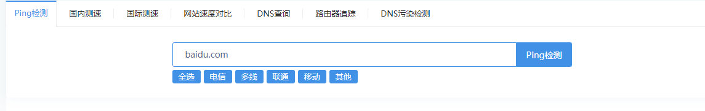
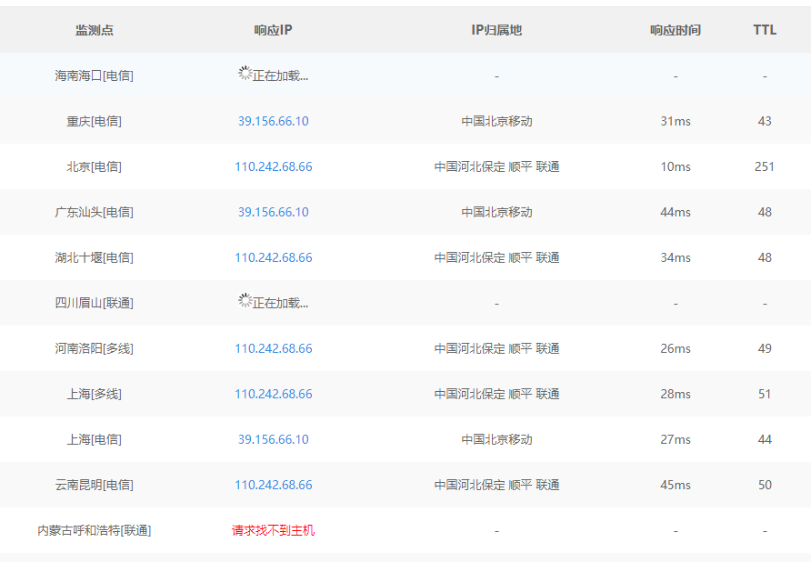
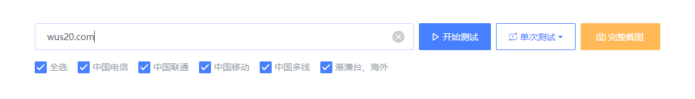
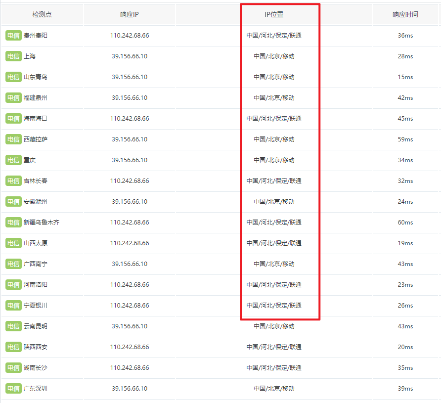
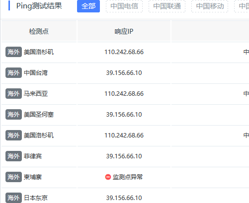
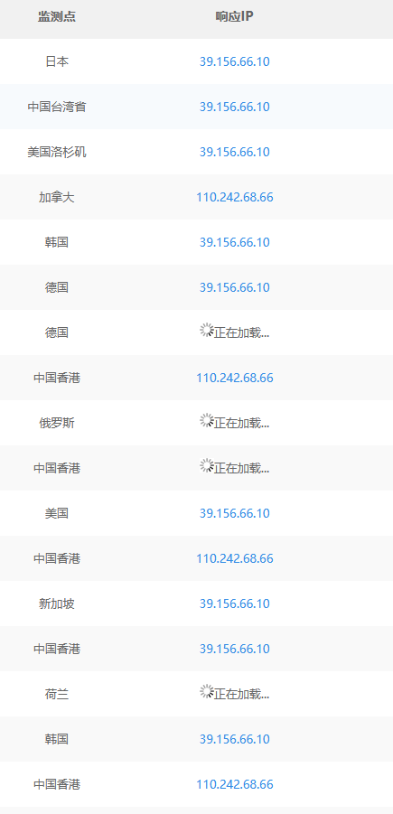

# CDN

CDN: 主服务器的副本,方便全国各地快捷访问相同的资源


下面是CDN的一些例子

通过多个地方ping同一个域名

就发现不同的ip去响应


https://ping.chinaz.com/



结果




https://www.itdog.cn/ping/



可以看到多个地方出现了响应,他们就是对于服务器的子服务器,可能也叫CDN



那些不同的响应IP就是对应的CDN服务器

我们通常要寻找到主服务器,也就是那个真实的IP,

而不是CDN服务器的IP


# 如何绕过CDN


## 域名解析记录

```
https://viewdns.info/iphistory
https://site.ip138.com
https://x.threatbook.com/
```


通过一些域名解析记录,

然后看他的注册时间

我们可能去发现他的真实IP


>   备案查询


```
https://beian.miit.gov.cn/#/Integrated/recordQuery
https://beian.tianyancha.com/ie5c91690282143559179#!
https://icp.chinaz.com/
```


## 网络空间信息搜索引擎

基于设备什么的,比如路由器,摄像头什么的

shoda: https://www.shodan.io/

奇安信出品: https://hunter.qianxin.com/

censy: https://search.censys.io/

360: https://quake.360.net/quake/#/index


## 子域名


## 异地ping

也就是不在中国对域名ping

而是通过国外的地方对国内的某个域名ping






## 信息泄漏

服务器日志文件

探针文件，例如phpinfo。

网站备份压缩文件

.DS_Store

.hg

.git

.SVN

.Web.xml

## 其他方式

接收邮件、App、网站存在的漏洞、异常信息、调式信息、host碰撞
邮件常见交互功能点:
。RSS订阅
。邮箱注册、激活处。邮箱找回密码处。产品更新的邮件推送
·某业务执行后发送的邮件通知
·员工邮箱、邮件管理平台等入口处的忘记密码
