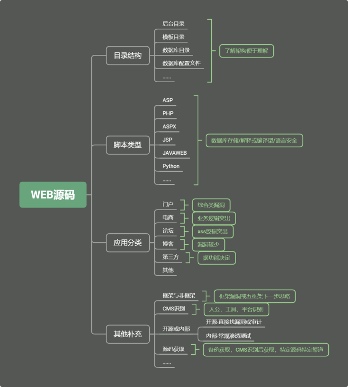
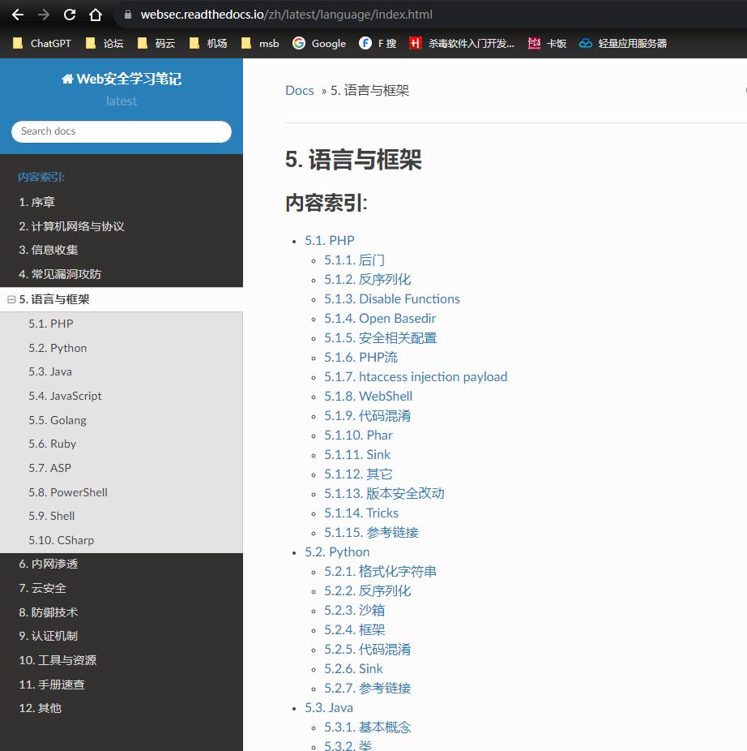

不同的语言容易产生哪些漏洞




网站的敏感目录和文件

```
index.php 根据文件后缀判定
admin 网站后台路径
data 数据相关目录
install 安装目录
member 会员目录
template 模板目录(和网站相关的整体架构)
data => confing.php 数据库配置文件，网站和数据库的通讯信息，连接账号密码，可以去连接对方数据库，从数据库去得到这个网站的源码里面涉及到的管理员的账号密码。
```


**关于Web源码其他说明**

如果对方网站采用的是框架开发的话那么你面对的就是寻找框架的漏洞，

如果是非框架的话寻找的漏洞针对的是代码写出来的漏洞

CMS识别：判定一个网站是用什么程序搭建的

开源：去网上找寻漏洞文章。

内部：常规的渗透测试，用扫描工具去判断。

关于源码的获取途径：搜索(百度,Google)，闲鱼淘宝，第三方源码站(菜鸟源码,)，各种行业对应。


CMS识别也可以利用一些在线网站

涉及一个字典

