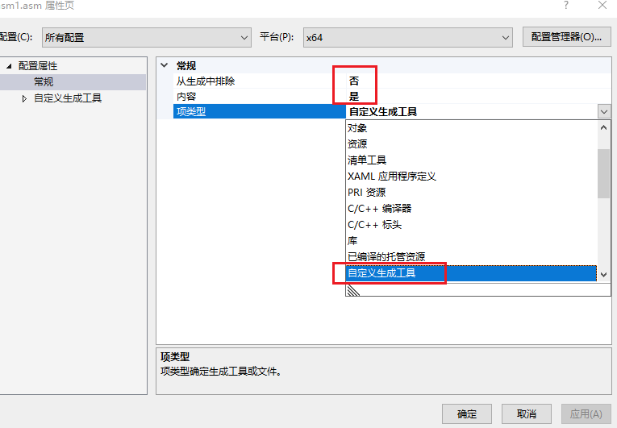
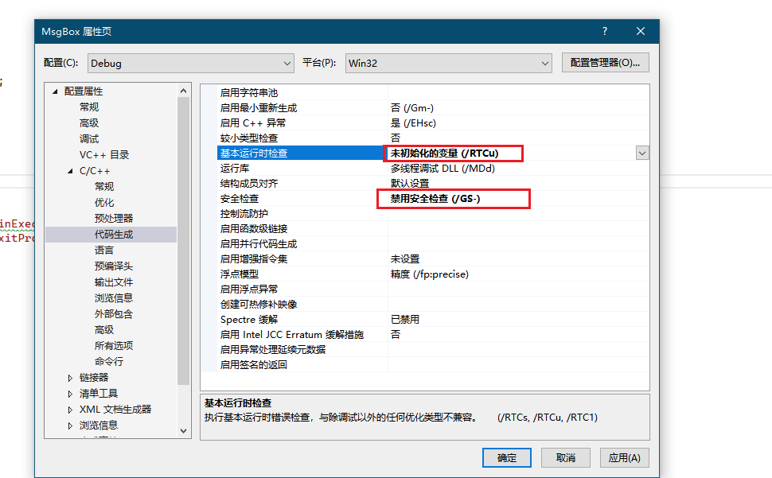
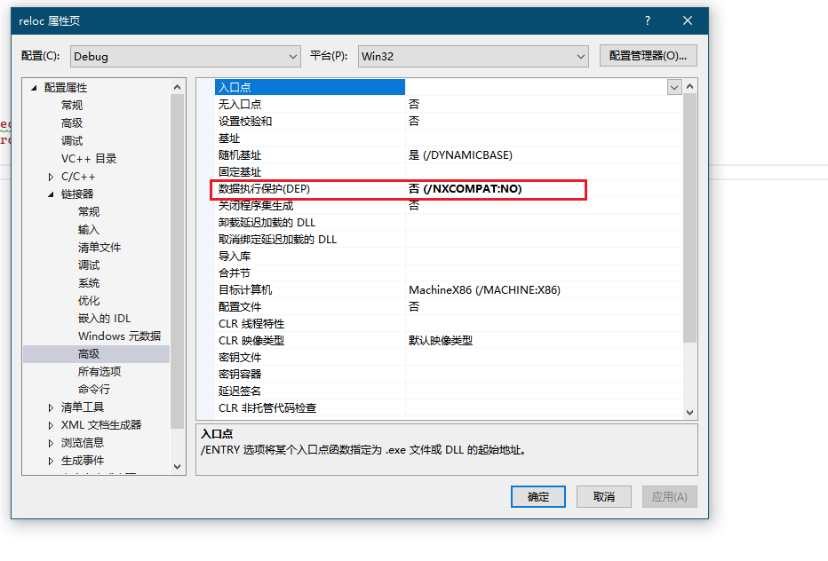

# 异常处理

在没有配置的情况下&&在调试的情况下

如果程序遇到异常,,,就会一直卡住,不会交付给用户写的异常处理程序

如果出现异常,并且把异常交付给用户的处理程序,需要做一些过程的配置

 


然后逐个浏览

于是取消勾选对应的异常

vs的调试器在遇到异常的时候,就把异常交付给用户自定义的处理程序
而不是报错

# 搭配x64的内联汇编环境-way1

有时候,TMD就是配置失败

有时候又成功


比如写了写了下面的汇编

```nasm
.CODE
 
Int_3 PROC
		MOV EAX, 1234  ;返回1234
		RET
Int_3 ENDP
 
 
MY_TEST PROC
		MOV EAX, 23 ;返回23
		RET
MY_TEST ENDP
 
END
```

写入头文件

```c
#pragma once

#ifndef __ASMCODE_H
#define __ASMCODE_H

int _stdcall Int_3();
int _stdcall MY_TEST();

#endif
```

main函数文件(是main.c)

```c
#define  _CRT_SECURE_NO_WARNINGS
#include <Windows.h>
#include <stdio.h>
#include "head.h"
int main()
{   
	int x = Int_3();
	int y= MY_TEST();
	printf("%d", x + y);
	return 0;
}
```

然后做一些配置

右键asm文件


然后



然后


```c
ml64 /c %(fileName).asm
%(fileName).obj;%(Outpus)
```

然后就愉快的生成文件

```c
已启动重新生成...
1>------ 已启动全部重新生成: 项目: C1, 配置: Debug x64 ------
1>Microsoft (R) Macro Assembler (x64) Version 14.36.32535.0
1>Copyright (C) Microsoft Corporation.  All rights reserved.
1>
1> Assembling: asm1.asm
1>C1.c
1>C1.vcxproj -> E:\Code\normal\C\VisualStdio\Often\x64\Debug\C1.exe
========== “全部重新生成”: 1 成功，0 失败，0已跳过 ==========
========= 重新生成 开始于 12:42 PM，并花费了 01.394 秒 ==========

++++++++++++++++++++++++++++++++++++++++++++++++++++++++++++++++++++++++++++++++++++
+++                 Please consider donating to VSColorOutput                    +++
+++                       https://mike-ward.net/donate/                          +++
+++            (this message can be turned off in the settings panel)            +++
++++++++++++++++++++++++++++++++++++++++++++++++++++++++++++++++++++++++++++++++++++
```


# 搭配x64的内联汇编环境-way2

https://zhuanlan.zhihu.com/p/270397861


然后选择并确定


右键asm文件属性


选择


然后就差不多了


asm文件

```assembly
.CODE
 
Int_3 PROC
		MOV EAX, 1234  ;返回1234
		RET
Int_3 ENDP
 
 
MY_TEST PROC
		MOV EAX, 23 ;返回23
		RET
MY_TEST ENDP
 
END
```


c文件

```c
#define  _CRT_SECURE_NO_WARNINGS
#include <Windows.h>
#include <stdio.h>
//#include "head.h" 不用加

extern "C"   int _stdcall Int_3();
extern "C"   int _stdcall MY_TEST();
int main()
{
	int x = Int_3();
	int y = MY_TEST();
	printf("%d", x + y);
	return 0;
}
```


# 搭配x64的内联汇编环境-way3

https://www.cnblogs.com/jszyx/p/12808085.html

https://www.cnblogs.com/VxerLee/p/15185403.html

# 编译设置

## 一些基于源代码的编译指令


设置节区的属性

```
#pragma comment(linker, "/SECTION:.text,ERW")
```


## 关闭 CheckForDebuggerJustMyCode 


## 关闭 RTC_CheckEsp 




## 关闭 RTC_CheckEsp 


## 关闭 数据段不可执行



“ **pch”预编译头文件来自编译器的其他版本，或者预编译头为 C++ 而在 C 中使用它(或相反) and vs找不到路径**


## 如何让程序变得更小？ 像汇编那样

比如，导入表就只有一个导入函数

```c
#include<windows.h>
int my_main()
{
	MessageBoxA(0, "small", "(:", 0);
	return 0;
}
```

通过一些配置后，我们可以让程序只有2-3个函数

而且导入表只有2个API


然后


于是就可以正常编译了（我并不知道原理）

如果程序加入一些stdio.h标准库的调用，就会g

但是MessageBox不会


同时还要关闭GS检查

关闭支持仅我的代码调试


## 关于 (/MT),(/MTd),(/MD),(/MDd）

配置属性->C/C++->代码生成->运行库->MT或者MTD

其实就是一个分为2模式

和多线程啥的没关系

分为dbg和release

在每个分支之后,有分为静态和动态的

动态的就是API加载呗

静态的就是把多数代码写入到exe中

# 如何脱离VS运行环境

这个就是基于vs运行库下静态编译和动态编译的一些东西了

也就输说如果你用的是静态编译,那么就可以脱离vs的运行环境

但是对于这些kernel32,user32我暂时还不知道如脱离

如何脱离?

那就多线程MD/MTD啦

配置属性->C/C++->代码生成->运行库->MT或者MTD

如果说连启动函数都不要的话,,那就直接修改入口点


