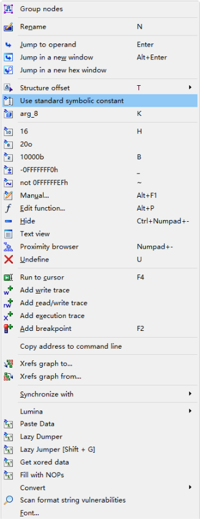
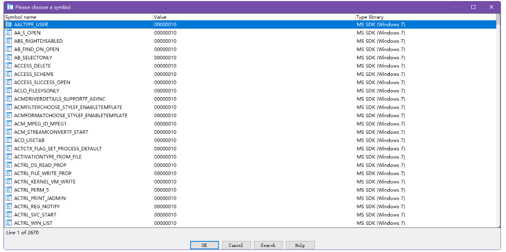
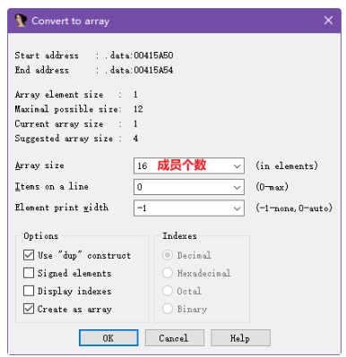
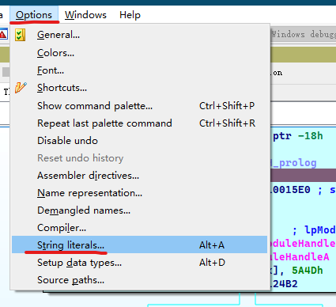
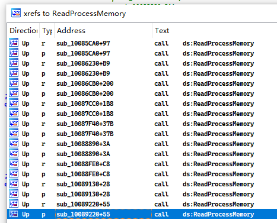

# 基本使用


书籍<<加密解密.4>>的某个章节讲得很好

# IDA快捷键

P: 生成函数

C:生成汇编代码

U: 取消定义

D: 生成2/4/8字节的数据

A :形成字符串

N 重命名

H: 16进制转化

# 如何创建一个结构体

# 条件断点

暂时不知道,下面是收集的一些信息

参考链接

[https://www.cnblogs.com/Fang3s/p/4367588.html](https://www.cnblogs.com/Fang3s/p/4367588.html)

IDC

```
strstr(GetString(Dword(esp+4),-1, 0), "SAEXT.DLL") != -1
Dword(Dword(esp)+4)==0x202
```

```
if (get_reg_value("rip") != xxx)
{
    suspend_process();//挂起
}
```

IDAPython


```c
head = GetRegValue("ESP")
head = Dword(head)
#head = Dword(cpu.ESP+0xAC)
#head = get_dword(cpu.ESP+0xAC)
print(head)
if(head == 0x111):
    return True
return False
```

# **异常捕捉**


yes: IDA不处理,让程序自己处理
no: 忽略该异常,原处执行

# **格式化指令操作数**

比如win32 的消息处理函数 涉及很多的WM_xxx

```c
 qmemcpy(v10, &unk_415A60, 0x17u);
  switch ( a2 )
  {
    case 16:
      DestroyWindow(hWnd);
      break;
    case 272:
      IconA = LoadIconA(hInstance, (LPCSTR)0x70);
      SendMessageA(hWnd, 0x80u, 1u, (LPARAM)IconA);
      SendDlgItemMessageA(hWnd, 110, 0xC5u, 0x50u, 0);
      break;
    case 273:
      DialogBoxParamA(hInstance, (LPCSTR)0x67, hWnd, sub_40100F, 0);
      return 1;
    default:
      return 0;
  }
```

于是我们要把对应的数值(16,272,273)变为有意义的符号

首先来到反汇编

```
cmp     [ebp+var_FC], 16
```

右键数值16,选择Symbolic 或者use stander symbloc constant之类的

或者快捷键M



然后选择差不多与之对应的,因为0x10的代表的意思很多,所以你还要筛选一遍



我们的是WM_开头的
可以发现,与16对应的就只有WM_CLOSE


于是选中即可

于是结果

```
cmp     [ebp+var_FC], WM_CLOSE
```

伪代码也发生了自动改变

```
 switch ( a2 )
  {
    case WM_CLOSE:
      DestroyWindow(hWnd);
      break;
    case WM_INITDIALOG:
      IconA = LoadIconA(hInstance, (LPCSTR)0x70);
      SendMessageA(hWnd, 0x80u, 1u, (LPARAM)IconA);
      SendDlgItemMessageA(hWnd, 110, 0xC5u, 0x50u, 0);
      break;
    case WM_COMMAND:
      DialogBoxParamA(hInstance, (LPCSTR)0x67, hWnd, sub_40100F, 0);
      return 1;
    default:
      return 0;
  }
```

# 关于字符串的A

IDA一般默认是C的字符串

也就是字符串以0结尾

当然我们也知道,字符串的编码类型还有很多

比如utf-8,unicode...,gb-312

总之你要知道这些

# 形成数组

对准一块数据,然乎*一下


就会出现



然乎就形成数组了


# FLIRT

我们之前在一个CTF写rust的题目的时候,发现很多rust封装的函数

IDA没有识别出来

为了解决这个问题,FLIRT很好的解决了

为什么c语言strlen这类函数可以识别出来

因为对应的身份信息导入flirt里面去了

所以的话,后面遇到再详细说吧

<<加密解密>>.81

# **做标记 mark**

对准一个地址 alt m 然后输入该地址的描述


后面无论走多远,只要ctrl m


就可以找到以前的地址

# 配合paylaod的IDA

linux 开启2个东西

1), 先socat

```
 socat tcp-listen:12345,reuseaddr,fork EXEC:./you_elf_paty,pty,raw,echo=0
```

后然后python->pwntool就连接

```
 host="192.168.71.129"
 port=12345 #不是IDA的端口
 p=remote(host,port)
```

2),于是 linux_server64  默认端口还是 23946 不变

3), 最后,IDA -> Debuger -> attach to process -> 选择你用socat打开的elf

4), 愉快的交互吧

注意要在IDA下断点哟

# UTF-16字符串显示


之前肯定不是这样现实的,而是下面这样


改变的方法,就是设置一些东西就可以了



然后选择


然后就大功告成


# 寻找关键位置


## 手法1


我想寻找OpenProcess和ReadProcessMemoryAPI调用的地方


看一下OpenProcess


看一下ReadProcessMemory



这下子懵逼了

其实的话,我们可以对比2个交叉引用

去发现相同的函数

其实就会发现,他们都调用了sub_10087CC0

这就什么我们要找的关键位置就在 sub_10087CC0

