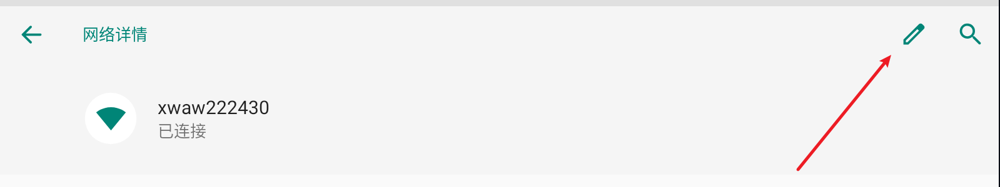
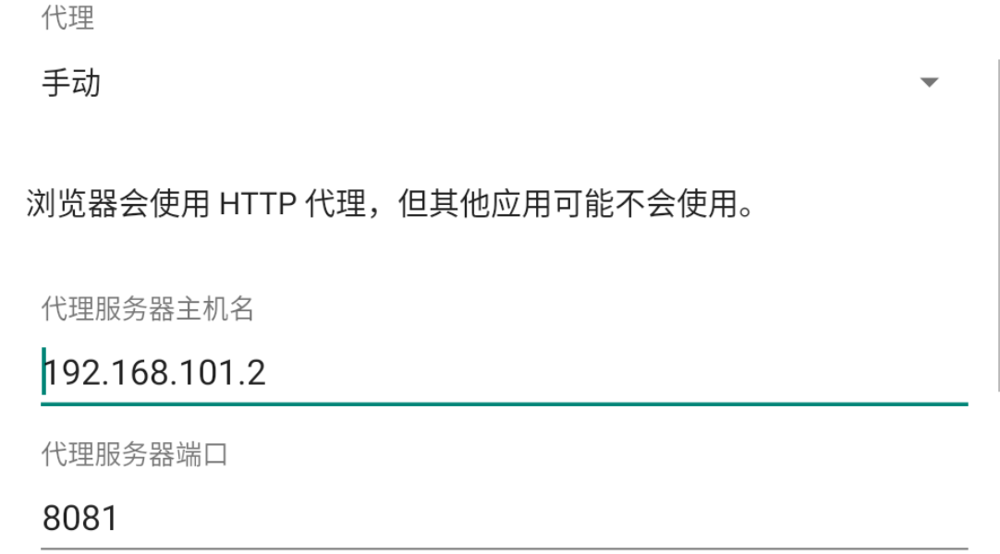
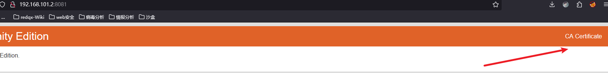
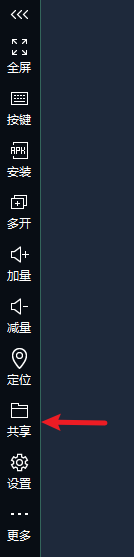
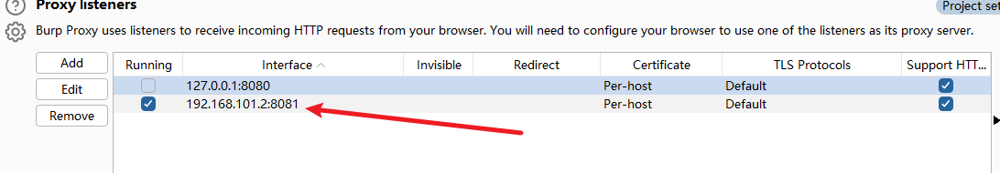
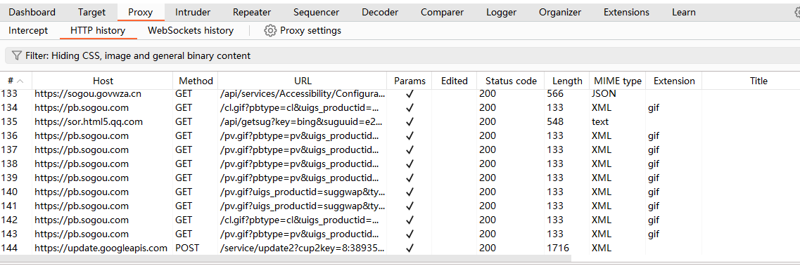
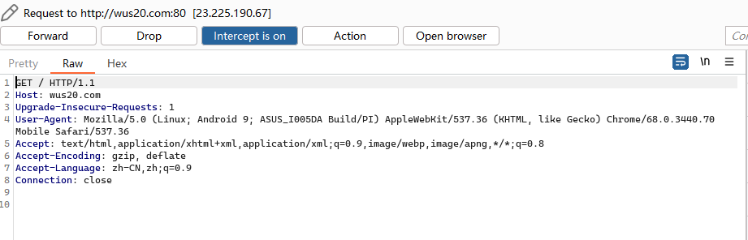

如果下载的绿色的专业版版本, 需要配置一个java的环境变量

如果下载的是社区的x64 windwos 版本,直接安装就可以使用


中文手册 https://www.bookstack.cn/read/Burp_Suite_Doc_zh_cn/Burp_Suite_Documentation-README.md

社区版


# 设置字体,字形,编码


字体大小


字体样式


编码


# 其它

她还有什么一些其它的功能

比如站点地图 sitemap, 其原理就是爬取和强求一个网页,然后生成一个地图

比如对目标网站扫描之类的,反正以后实战遇到了再说吧

因为是基于报文的,所以我们burp甚至可以不断的修改报文的ip,对一个网站不断的放弃一个请求来攻击


# App抓包

环境: 

逍遥模拟器+BurpSuit

笔记本电脑搭载逍遥模拟器,

笔记本电脑连接的WIFI,逍遥模拟器默认连接了一个WIFI,处于有网阶段


配置模拟器:

ps: 我试了一下夜神模拟器,感觉麻烦就没用它


WIFI配置



然后



只需要选择

```
代理: 手动
代理服务器主机名: 我的笔记本电脑IP
代理服务器端口: 我的笔记本Burp抓包的端口
```

过会模拟器还要安装CA证书


然后去配置笔记本外机的BurpSuit:

首先下载证书: 

浏览器访问本机IP:8081



点击下载

然后重命名文件后缀为.cer

然后把cer证书给模拟器的



逍遥模拟器有一个共享文件夹的功能,只需要一键开启

ps: 我们无法ctrl c 和ctrl v复制

开启共享文件夹很简单

然后继续前往模拟器

设置->安全性和位置信息->加密与凭据->从SD卡安装证书

ps: 你没有SD卡,所以到时选择系统目录下,你的CA证书路径

双击即可完成安装


然后配置笔记本外机的burpSuir



IP是本机的IP,端口和模拟器那里的代理配置要保持相同

然后over,可以抓包了






