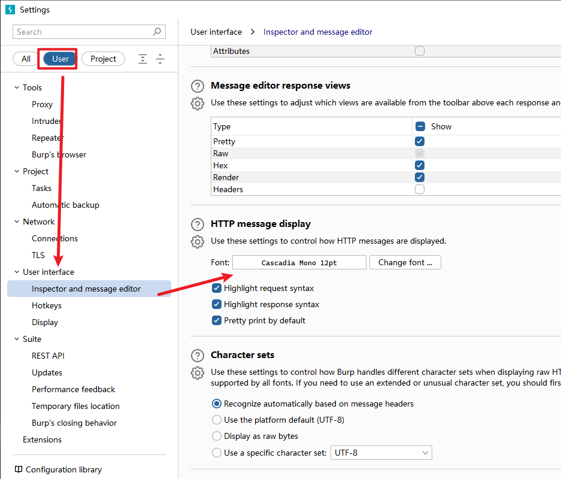
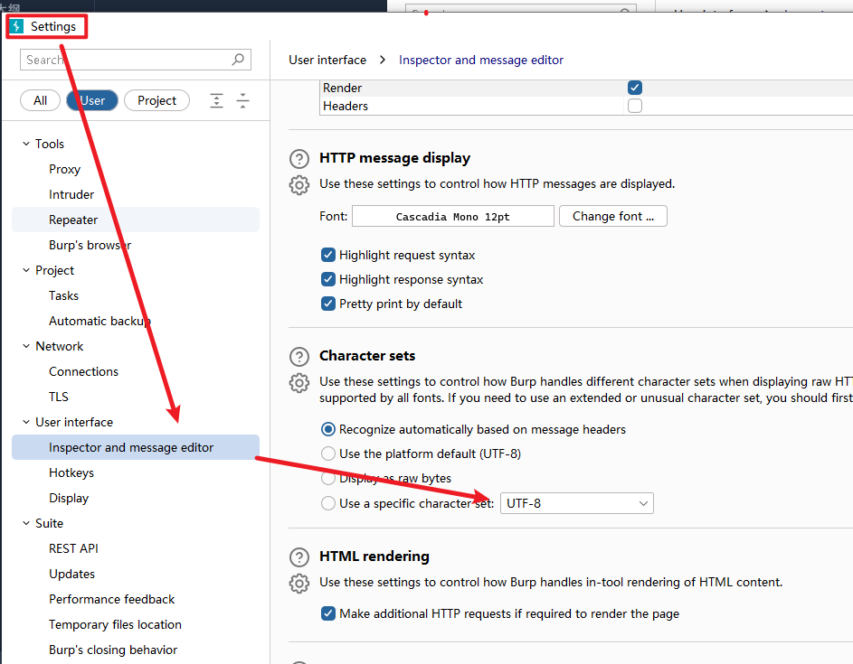

如果下载的绿色的专业版版本, 需要配置一个java的环境变量

如果下载的是社区的x64 windwos 版本,直接安装就可以使用

中文手册 https://www.bookstack.cn/read/Burp_Suite_Doc_zh_cn/Burp_Suite_Documentation-README.md

# 社区版

## 设置字体,字形,编码

字体大小

字体样式

编码

