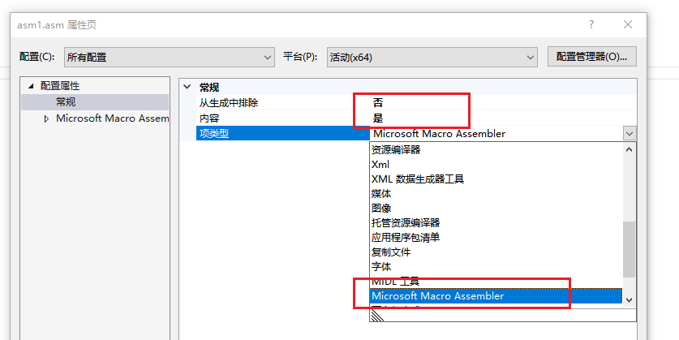

# visual stdio

# 异常处理

在没有配置的情况下&&在调试的情况下

如果程序遇到异常,,,就会一直卡住,不会交付给用户写的异常处理程序

如果出现异常,并且把异常交付给用户的处理程序,需要做一些过程的配置


然后逐个浏览

于是取消勾选对应的异常

vs的调试器在遇到异常的时候,就把异常交付给用户自定义的处理程序
而不是报错

# 搭配x64的内联汇编环境-way1

有时候,TMD就是配置失败

有时候又成功


比如写了写了下面的汇编

```nasm
.CODE
 
Int_3 PROC
		MOV EAX, 1234  ;返回1234
		RET
Int_3 ENDP
 
 
MY_TEST PROC
		MOV EAX, 23 ;返回23
		RET
MY_TEST ENDP
 
END
```

写入头文件

```c
#pragma once

#ifndef __ASMCODE_H
#define __ASMCODE_H

int _stdcall Int_3();
int _stdcall MY_TEST();

#endif
```

main函数文件(是main.c)

```c
#define  _CRT_SECURE_NO_WARNINGS
#include <Windows.h>
#include <stdio.h>
#include "head.h"
int main()
{   
	int x = Int_3();
	int y= MY_TEST();
	printf("%d", x + y);
	return 0;
}
```

然后做一些配置

右键asm文件


然后


然后


```c
ml64 /c %(fileName).asm
%(fileName).obj;%(Outpus)
```

然后就愉快的生成文件

```c
已启动重新生成...
1>------ 已启动全部重新生成: 项目: C1, 配置: Debug x64 ------
1>Microsoft (R) Macro Assembler (x64) Version 14.36.32535.0
1>Copyright (C) Microsoft Corporation.  All rights reserved.
1>
1> Assembling: asm1.asm
1>C1.c
1>C1.vcxproj -> E:\Code\normal\C\VisualStdio\Often\x64\Debug\C1.exe
========== “全部重新生成”: 1 成功，0 失败，0已跳过 ==========
========= 重新生成 开始于 12:42 PM，并花费了 01.394 秒 ==========

++++++++++++++++++++++++++++++++++++++++++++++++++++++++++++++++++++++++++++++++++++
+++                 Please consider donating to VSColorOutput                    +++
+++                       https://mike-ward.net/donate/                          +++
+++            (this message can be turned off in the settings panel)            +++
++++++++++++++++++++++++++++++++++++++++++++++++++++++++++++++++++++++++++++++++++++
```


# 搭配x64的内联汇编环境-way2

https://zhuanlan.zhihu.com/p/270397861


然后选择并确定


右键asm文件属性


选择




然后就差不多了


asm文件

```assembly
.CODE
 
Int_3 PROC
		MOV EAX, 1234  ;返回1234
		RET
Int_3 ENDP
 
 
MY_TEST PROC
		MOV EAX, 23 ;返回23
		RET
MY_TEST ENDP
 
END
```


c文件

```c
#define  _CRT_SECURE_NO_WARNINGS
#include <Windows.h>
#include <stdio.h>
//#include "head.h" 不用加

extern "C"   int _stdcall Int_3();
extern "C"   int _stdcall MY_TEST();
int main()
{
	int x = Int_3();
	int y = MY_TEST();
	printf("%d", x + y);
	return 0;
}
```


# 搭配x64的内联汇编环境-way3

https://www.cnblogs.com/jszyx/p/12808085.html

https://blog.csdn.net/huxyc/article/details/106961556

https://www.cnblogs.com/VxerLee/p/15185403.html

# 编译设置

关闭 j_@__CheckForDebuggerJustMyCode@4


关闭 j___RTC_CheckEsp无security_cooke检查


关闭 j___RTC_CheckEsp有security_cooke检查


关闭 关闭堆栈不可以执行


“ **pch”预编译头文件来自编译器的其他版本，或者预编译头为 C++ 而在 C 中使用它(或相反) and vs找不到路径**

