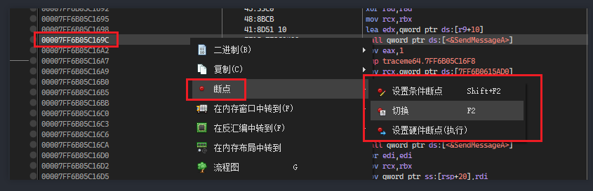
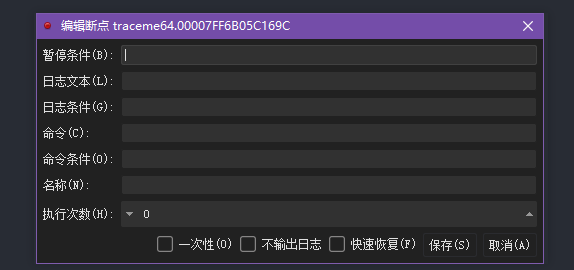
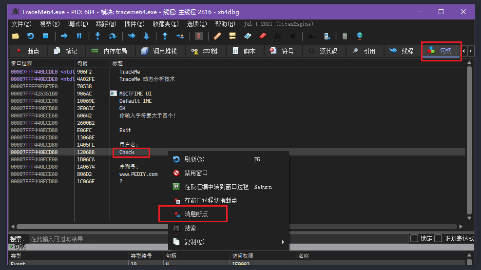

# OD_X64dbg


# OD

你的配置文件都在ollydbg.ini里面

udd文件:你每每调试一个exe,它的断点,注释信息都在里面


## 快捷键

ctrl f9 :运行到ret的时候停下

alt f9 从dll回到用户代码

ctrl f7 一直步入,遇到esc/断点就停止

ctrl f8 一直歩过,遇到esc/断点就停止

alt B 查看已经设置的所有断点 对于断点,可以切换他的状态 激活/暂用/删除

ctrl g 类似于IDA的g,你可以输入API的函数名字,可以去往API的入口地址

减号 回到上一步的状态

加号 查看下一步,是你已经执行的下一步,不是还没有执行的,建立在减号的基础上

ALT B 查看断点, space 可以让断点处于always和Disable状态,Del键删除断点

CTRL N 查找所有API的name,Enter查看API的交叉引用,再次Enter可以查看API被哪里引用

Alt M 内存分页查看

Alt B 查看断点

Alt C 回到CPU

run trace 调试记录

在debug->open or clear trace 中打开或者清楚trace

他会记录你调试的指令和寄存器的一些数据到缓冲区

在view->run trace 中可以查看,可以点击按钮 `...`

在这里可以设置缓冲区的大小

选中一个函数地址, ,右键,在反汇编窗口中跟随,及可以查看对应的反汇编数据

选中一个数据地址,右键,在数据窗口中跟随,就可以查看它指向的数据

## 断点分类

> 0xcc断点:
> 

也就是把对应的指令设置为0xcc 然后触发异常

> 硬件断点:
> 

原理是通过一组特殊的寄存器DRx调试寄存器,去判断是否触发断点异常

不会有0xcc的出现

硬件断点[读取断点,写入断点,执行断点]

断下来的地方位于标记处的下一条指令

> 软件断点
> 

不会有0xcc 原理是对一块内存设置位不可访问或者不可写入的权限,否则引发异常

软件断点[写入断点,读取断点]

断下来的地方位于标记处

ps:软件断点和硬件断点大同小异,硬件断点最多4个,软件断点越少越好,否则引起dbg卡顿缓慢

软件断点也可以得到硬件断点相同的效果

> 内存模块断点
> 

当该内存模块被读取或者执行的时候,就触发断点,该断点会死一次性的

> 消息断点
> 

主要和UI的空间有关,涉及很多句柄之类的

> 条件断点
> 

就是根据寄存器的数值,或者寄存器指向的数据 满足某些数据就引发断点

## 插件

run trace: 实现被指向指令的记录

hit trace: 帮助调试者辨别哪些代码被执行过或者没有执行

...

# x64dbg

## 插件

dump 地址

同步调试的一个插件

[https://pan.baidu.com/s/1t0rizUu1I8NoT_nbfj3rog](https://pan.baidu.com/s/1t0rizUu1I8NoT_nbfj3rog)

[https://www.52pojie.cn/thread-1009719-1-1.html](https://www.52pojie.cn/thread-1009719-1-1.html)

## 快捷键

ctrl g 就可以输入API的名字

很多快捷键和OD类似

## 断点



0xcc断点和硬件断点直接小白方式设置

> 条件断点
> 



> 内存断点
> 


> 消息断点设置
> 

(win32):

点击句柄:刷新

选择一块控件,比如选择`check`

然后右键,选择消息断点




## cmd

```
 dump eax
 内存窗口就会显示eax开始的地址
```