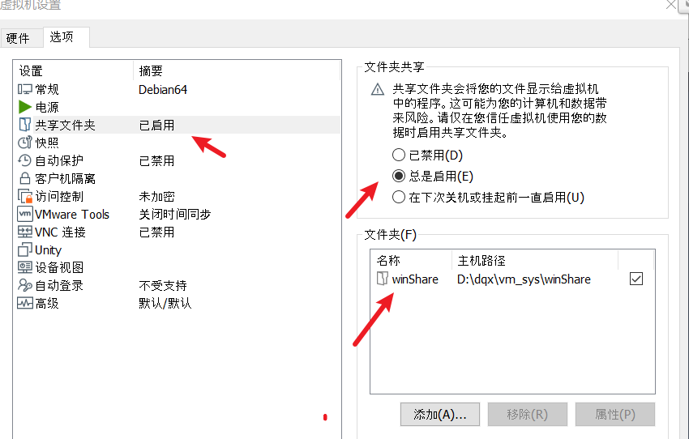

# 疑难杂症


## IDA动态调试问题

关于动态调试,就不多说了

动态调试报错1

```
┌──(kali㉿kali)-[~/code]
└─$ ./hardCpp
./hardCpp: error while loading shared libraries: libc++.so.1: cannot open shared object file: No such file or directory
```

解集办法

```
apt install libc++-dev
```


[https://blog.csdn.net/qq_21920075/article/details/126750473](https://blog.csdn.net/qq_21920075/article/details/126750473)

## 关于用户创建问题

创建后没家目录,奇怪

root创建的用户 普通用户无法su

所以就用普通用户创建用户把

```bash
sudo useradd -m username
```

创建家目录

```bash
sudo mkhomedir_helper username
```


# ssh 连接


```
vim /etc/ssh/sshd_config 
/etc/init.d/ssh restart  
service ssh start  #开启ssh服务
update-rc.d ssh enable
```


# ssh 免密码连接 

参考链接 [https://www.jianshu.com/p/b7a105a67253](https://www.jianshu.com/p/b7a105a67253)

在windwos terminal 的 setting.json 文件添加一个配置

```
{
    "commandline": "ssh 登录用户名@虚拟机IP -p 连接的端口号",
    //"commandline": "ssh kali@192.168.71.129 -p 22",
    "guid": "{c2b7c779-0f4f-4476-bfa5-313b42c9851a}", //不管
    "hidden": false, //不管
    "name": "vm-Kali" //取个名字
}
```

然后就可以连接了

每次连接要输入密码

于是采用一下操作

用git生成公开密钥文件

git的指令: ssh-keygen

```
cd ~
vi tmp.pub //这里要手动输入文件,然后保存退出
mkdir .ssh && chmod 700 .ssh
touch .ssh/authorized_keys && chmod 600 .ssh/authorized_keys
cat tmp.pub >> .ssh/authorized_keys
rm tmp.pub

```


# Pwn环境安装


## Hyperpwn


安装hyper 

```
https://hyper.is/#installation
```

deb的安装不多说,正常情况不报错

然后安装

```
hyper i hyperinator
hyper i hyperpwn	
```

然后安装

```
sudo apt install gdb-multiarch
```

ps: 默认你已经安装了pwngdb


最后打开

```
hyper
```

在hyper中输入

```
gdb-multiarch
```

## angr模块安装

可以参考链接 [https://blog.csdn.net/weixin_45055269/article/details/105176185](https://blog.csdn.net/weixin_45055269/article/details/105176185)

pip安装建议使用豆瓣源，速度飞起

### 安装virtualenv

```
pip3 install -i http://pypi.douban.com/simple --trusted-host pypi.douban.com virtualenv
```

### 创建目录

mkdir angr

cd angr

### 创建环境

virtualenv   env1

### 进入对应的环境

source venv/bin/activate

### 安装angr

pip3 install -i http://pypi.douban.com/simple --trusted-host pypi.douban.com angr

如果后面缺少什么

就直接

pip3 install -i http://pypi.douban.com/simple --trusted-host pypi.douban.com xxx


### 退出当前venv环境


```
deactivate
或者
source deactivate
```


# 常用软件安装


## alias


```
vim ~/.bashrc 
source ~/.bashrc 
```


## vscode安装


直接下载tar.gz版本,解压缩即可使用


## fclash


## pip源


```
pip config set global.index-url https://pypi.tuna.tsinghua.edu.cn/simple


```


## fsearch安装


github官网有教程的


## 共享文件夹挂盘

```
https://blog.csdn.net/anlz729/article/details/106826215
```


首先得安装vmware-tools, 默认应该是安装了的

```
sudo apt-get install open-vm-tools 
```


vmware配置



Linux配置

```
sudo mkdir /mnt/share_linux  # 创建一个挂载目录share_linux
sudo vmhgfs-fuse .host:/winShare /mnt/share_linux
```

ps: 共享文件夹是linux访问主机的文件夹,而不是主机访问linux


但是只有root可以访问

解决指定用户访问

```
redqx@DebianYY:~/Desktop$ id
uid=1000(redqx) gid=1000(redqx) groups=1000(redqx),24(cdrom),25(floppy),29(audio),30(dip),44(video),46(plugdev),109(netdev),112(scanner)

```


然后

```
redqx@DebianYY:~/Desktop$ sudo /usr/bin/vmhgfs-fuse  .host:/ /mnt/share_road  -o allow_other -o uid=1000 -o gid=1000 -o umask=022 -o nonempty

```


我得linux目录是`/mnt/share_road`


然后就完毕了

```
root@DebianYY:/mnt/share_road# pwd
/mnt/share_road
root@DebianYY:/mnt/share_road# cat flag.txt 
D0g3{__________________}
root@DebianYY:/mnt/share_road# 

redqx@DebianYY:/mnt$ ls -al
total 13
drwxr-xr-x  3 root  root  4096 Oct 10 00:27 .
drwxr-xr-x 19 root  root  4096 Oct  9 13:19 ..
drwxr-xr-x  1 redqx redqx 4192 Oct 10 01:55 share_road

```


最后设置一个开机启动

```
sudo vim /etc/fstab //打开配置文件
.host:/ /mnt/hgfs             fuse.vmhgfs-fuse   allow_other,uid=1000,gid=1000,umask=022   0 0
```


# x86


## 编译x86

安装

```
sudo apt-get install build-essential module-assistant  
sudo apt-get install gcc-multilib g++-multilib  
```


编译链接

```
gcc -m32  -o main.elf  
```


## 运行x86


```
sudo apt-get install apt-file
apt-file update


apt-file search xxx

apt-file search libstdc++.so.6

apt-get install lib32stdc++6

apt-get install libc6:i386 libexpat1:i386 libfontconfig1:i386 libfreetype6:i386 libgcc1:i386 libglib2.0-0:i386 libice6:i386 libpcre3:i386 libsm6:i386 libuuid1:i386 libx11-6:i386 libxau6:i386 libxcb1:i386 libxdmcp6:i386 libxext6:i386 libxrender1:i386 zlib1g:i386 libx11-xcb1:i386 libdbus-1-3:i386 libxi6:i386 libsm6:i386 libstdc++6:i386

```


# ficx中文输入法


```
sudo apt update
sudo apt upgrade
sudo apt install fcitx
#安装fcitx框架
sudo apt install fcitx-googlepinyin
#安装Google输入法
```

**重启Kali**

然后就是常规设置了

```
https://blog.csdn.net/weixin_44257023/article/details/120386239
https://blog.csdn.net/qin9800/article/details/123232852
```


# 常用指令


> 解压缩

```
tar -zxvf code.tar.gz
unzip xxx.zip -d xxx_path

deb安装 dpkg -i xx.deb
```


> shsll切换

当前使用的sh

```bash
echo $SHELL
```

有哪些sh

```bash
cat /etc/shells
```

切换sh

```bash
chsh -s /bin/bash
```

