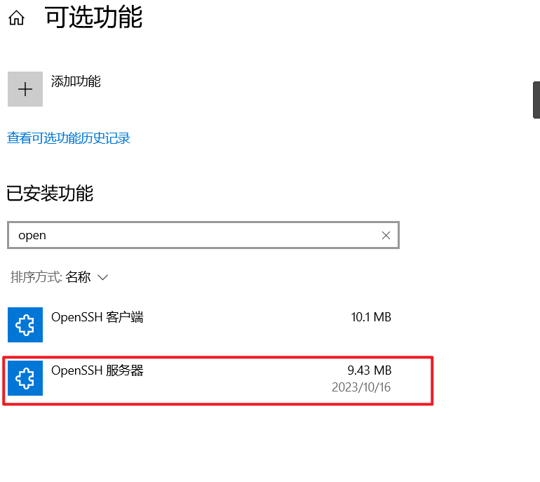

# 博客


Fluid , Stellar , Wikitten, Docsify


# Ping指令

[解决Windows 10 防火墙开启后无法ping通的问题_COCO56（徐可可）的博客-CSDN博客](https://blog.csdn.net/coco56/article/details/105800213)

# PIP镜像源（国内）

常见pip镜像源（国内源）

清华：[https://pypi.tuna.tsinghua.edu.cn/simple](https://pypi.tuna.tsinghua.edu.cn/simple)

阿里云：[http://mirrors.aliyun.com/pypi/simple/](http://mirrors.aliyun.com/pypi/simple/)

中国科技大学 [https://pypi.mirrors.ustc.edu.cn/simple/](https://pypi.mirrors.ustc.edu.cn/simple/)

华中理工大学：[http://pypi.hustunique.com/](http://pypi.hustunique.com/)

山东理工大学：[http://pypi.sdutlinux.org/](http://pypi.sdutlinux.org/)

豆瓣：[http://pypi.douban.com/simple/](http://pypi.douban.com/simple/)

为什么使用这些源? 让pip下载起飞呗

如何使用这些源?

```
pip install -i https://pypi.tuna.tsinghua.edu.cn/simple 要下载的模块
```

比如下载pyDes

```
pip install -i http://mirrors.aliyun.com/pypi/simple/ --trusted-host mirrors.aliyun.com pyDes
```


# 其它


dll下载 [https://cn.dll-files.com/](https://cn.dll-files.com/)

phpstorm破解版: [https://www.php.cn/blog/detail/1046985.html](https://www.php.cn/blog/detail/1046985.html) , [https://www.bilibili.com/read/cv18994018](https://www.bilibili.com/read/cv18994018)


# win10开启ssh连接


首先得安装这个




然后就OK了

然后cmd管理员启动 ,注意得是管理员

```
Microsoft Windows [Version 10.0.19045.3570]
(c) Microsoft Corporation. All rights reserved.

C:\Users\redqx>net start sshd
The OpenSSH SSH Server service is starting..
The OpenSSH SSH Server service was started successfully.


C:\Users\redqx>
```


```
net start sshd # 启动
net stop sshd # 关闭
```


# 任务栏完全隐藏

就那种鼠标移动过去也是完全隐藏那种

https://blog.csdn.net/sunddy_x/article/details/128218813

https://github.com/ihameed/task-homie/releases/tag/v1.0.0

注意,,我们仍然需要开启任务栏自动隐藏的选项

https://www.kyleblog.cn/posts/win10_ssh_service
