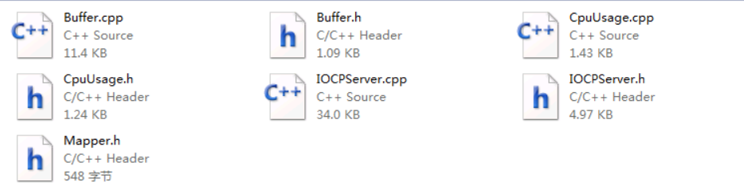
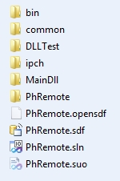
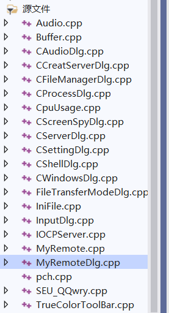

# 导言

一个远控,它的架构和组成当然很大

我感觉我们没有必要去关心一些不是很关键的部分

就比如这个录音监听`Audio`这一方面,我们只需要关心如何调用这个接口

而不是刨根问底的去深究这个class是怎么写的, 当然,如果你要对一些模块功能进行一个维护

比如说对录音监听模块进行一个更新,那么你当然需要对这个模块非常的了解

问? 哪些模块是我们需要去重点关心的?

woc,除了一些比如音频监听,视频管理以外,其它都要去分析,,,,,

而且socket是重点分析的,因为他是一个数据传输的功能


几篇参考的文章

```c
https://github.com/iGh0st/gh0st3.6_src/tree/master
https://blog.csdn.net/qq_30145355/article/details/80413883
https://blog.csdn.net/bingran6/article/details/17285827
https://the-itach1.github.io/2022/08/10/%E5%9F%BA%E4%BA%8EGh0st%E7%9A%84%E8%BF%9C%E6%8E%A7%E9%A1%B9%E7%9B%AE%E7%AC%94%E8%AE%B0/
```


socket涉及的文件






这是一个解决方案，其中：

MainDll是客户端，一个动态链接库的工程；

DLLTest是加载dll的普通控制台工程；

PhRemote是服务端，MFC的界面。

Bin是我们输出文件夹，编译好的文件会在其中，其中又有两个文件夹，

PhRemote是主控端，server是被控端，server中放着exe和dll，点击exe就算启动了被控端。Common中放着三个工程都可能用到的文件。

ps: 这是网上对这些文件的叙述

说一下我的看法...

如果说像通过dll注入的方式去加载


在对话框初始化的时候,调用了一个

```c++
	//绑定socket端口
	ListenPort();
```

进入ListenPort()主要和一些ini文件读取有关,比如IP,端口,最大连接数

```c++
Activate(nPort, nMaxConnection,nIp);             //开始监听
```

进入Activate是初始化一些网络连接之类的

然后注册一个网络连接的回调函数

 ```
 if (m_iocpServer->Initialize((NOTIFYPROC)NotifyProc, NULL, nMaxConnections, nPort, nIp))
 ```


然后关于网络服务的功能开启,他的代码有点复杂,健壮性比较高,同时也比较混乱

所以就选择一下关键的处理函数分析


他引入了一些非常完整的机制



我们可以广泛的认为,他调用的这些类,是别人第三方写好的

然后调用这些类就像是调用API, 既然是API,当然就很复杂啦

所以选一些容易的去分析吧


其中和数据联合相关的服务端函数如下

添加一个上线的信息

```c++
LRESULT CMyRemoteDlg::OnOnlineAddToList(WPARAM wParam, LPARAM lParam)
```


关于远程终端这个东西

客户端:

就说一下自己的粗略的看代码,调试代码得一些收获

他是基于管道的数据传输,至于这个管道如何通过网络传输的,我暂时还不知道

对于了客户端

他创建了cmd进程, 然后cmd进程的输入输出都是通过管道这一个媒介

然后关于读写是双管道的,也就输一个管道用于cmd的写,另外一个管道用于cmd的读取

然后读写的得到的一些信息,又通过另外一个管道什么的

服务端:

服务端的话,,看了一下,远程终端他是通过对话框的方式画出来的

然后一些输出输出都是和客户端的管道关联在一起

所以服务端在这一方面,主要是起到一个传输数据,接受数据,cmd窗口绘制的一个过程吧

以上是看视频之前的一个大概分析,或者叫预习吧


