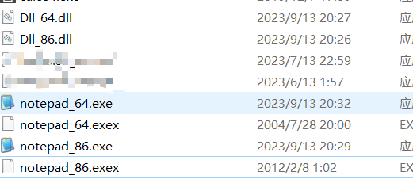

# 效果

该工具可是实现

对x64的exe注入一个x64的dll

对x86的exe注入一个x86的dll

如果错误的注入一些信息会导致程序运行失败的


注入一个x64的dll

```c++
D:\Projects\visual studio 2019\MyC0de\Debug>C1.exe "D:\Projects\test\notepad_64.exe" "Dll_64.dll"
```

注入一个x86的dll

```c++
D:\Projects\visual studio 2019\MyC0de\Debug>C1.exe "D:\Projects\test\notepad_86.exe" "Dll_86.dll"
```

实现的效果



其中exex文件是对原有文件的一个备份

DLL_xx.dll是要被加载的文件,该文件很简单,只不过是一个弹窗罢了


# 开发者手册


## main


```c++
int main(int argc,char* argv[])
{
    CHAR path_bak[256] = { 0 };
    char funcName[] = "redqx";
#ifdef  my_test
    CHAR fpath[] = "D:\\Projects\\test\\notepad_x64.exe";
    CHAR dllName[] = "Dll_64.dll";
#else 
    CHAR* fpath;
    CHAR* dllName ;
    if (argc != 3) {
        printf("USEAGE: exe_path dll_name\n");
        printf("example:\n");
        printf("inject.exe D:/redqx.exe demo.dll\n");
        return 0;
    }
    fpath = argv[1];
    dllName = argv[2];

#endif
   
    strcpy(path_bak, fpath);
    strcat(path_bak, "x");
    CopyFileWrapper(fpath, path_bak, FALSE);
    readPEinfo(fpath);//有一个问题,,就是我们把IAT表放入一个位置以后...IAT在写入的时候,该节去要有写入的权限的...否则IAT的初始化就有点问题的
    //如何检车一个IAT是否异常....
    inject_Dll(dllName,funcName);
    writeIntoFIle(fpath);
    GlobalFree(lp_Dos);
    return 0;
}
```


main函数很简单,有一些简单的宏定义

整体的流程就是 拷贝原有的文件,做一个备份

然后读取目标pe文件的信息

然后就对目标exe文件做一个基于dll的文件注入

然后保存文件

然后释放一些内存


然后读取目标pe文件的信息其实没有什么好去说的

注意x86和x64文件结构

然后重点在于流程`对目标exe文件做一个基于dll的文件注入`


## inject_Dll

基于文件的dll注入分很多情况

1), 他的导入表有空白的节区,,然后可以直接插入,需要去文件里面找新的内存,然后填充IAT之类的

2), 他的导入表没空白节区,,然后没办法插入,,需要去文件里面找新的内存,,然后迁移整个导入表,,,,然后填充IAT之类的

3), 他的导入表没空白节区,同时也没有多余的空间去迁移整个导入表,,所以需要在文件末尾新增加文件的大小,然后做一些文件的迁移

然后填充信息之类的


### couldInsert

couldInsert用于判断该导入表是否有空余的2个节区

然后其中1个节区用于存放我们新插入导入表,,另外1个节区用于做一个空白节区,,,作为保留项


```c++
xx = couldInsert(&index)
```

index用于存储最后一个导入表表所在的索引值

这个值同时也是原有的导入表个数

也是作为新的一个索引值值


xx会告诉我们是否可以在原有的基础上做一个插入

```c++
/*
 * 函数名称：couldInsert
 * 函数功能：判断在原来导入表的基础上,判断是否可以增加一个导入表(不需要寻新的内存那种)
 * 输入参数：无
 * 返回值：
 *  - 1 表示可以增加,在原来基础上增加
 *  - 0 表示不可以在原来基础上增加
 */
DWORD couldInsert(DWORD* index)
{
    //空2个导入表,就可以添加一个新的导入表
    //一个导入表大小20字节

    char zeroArea[20];
    int i = 0;
    memset(zeroArea, 0, 20);//一个导入表的大小
    while (lp_ImportDescriptor[i].Name)
    {
        i++;
    }//出来的i是空白节区
    *index = i;//这个i可能是我们要插入的地方
    if (!memcmp(&lp_ImportDescriptor[i + 1], zeroArea, 20))//观察空白节区的下一个节区
    {
        return 1;//有多余的2个节区,然后其中一个用于插入
    }
    else
    {
        return 0;
    }
}
```


### 新导入表的开辟

z这个空间需要多少呢?

在原有的基础上,,,需要增加2个导入表

并增加16*4行的空间


16x4用于存放

```c++
IAT;
INT;
导出函数;
dll名字;
```


### 内存寻找问题

就是在原来的内存里面找出一块空白的区域

然后让我们写入相关信息

这块内存我是这样要求的

```c++
1), 全是0是必须的;
2), 这块区域长度得>=我们要求的字节数;
3), 区块的地址得是16的倍数
```


调用的函数如下

```
 fa_start = FindZeroArea(16 * 4); 
```

fa_start是找到的FA地址

参数是我们要找的内存大小


 FindZeroArea的原理如下

确定寻找的范围是第一个节区到最后一个节区

然后就开始寻找

寻找的方式就是找一块全为0的区域

找到后,返回这个区域的长度

如果该长度<需求的

然后判断地址是不是16的倍数

如果不是,,那就地址下移动

```c++
DWORD FindZeroArea(DWORD addLen)//对导入表搬家,
{
    BYTE* lp_Start, * lp_End;
    DWORD FA_Start = 0;
    DWORD cnt;


    //去data节去找吧...正常情况下都会有一个data节区的
    lp_Start = (BYTE*)(lp_SectionHeaders[0].PointerToRawData + (DWORD)lp_Dos);
    lp_End = lp_Start + flen;


    while ((lp_Start < lp_End))
    {
        cnt = findNextZeroArea_lenght(lp_Start, lp_End);
        //lp_Start += cnt;
        if (cnt >= addLen)//找那个最大的区域,并且地址是4的倍数
        {
            //长度得满足
            //地址是16的倍数
            if ((DWORD)lp_Start % 16 == 0) {
                log("%08X:%08X\n", FA_Start, cnt);
                //我需要知道这个东西在哪一个节区...然后设置该节区是一个可以写入的属性
                return lp_Start - (DWORD)lp_Dos;
            }
            else {
                lp_Start += 1;
            }
        }
        else {
            lp_Start += cnt;
        }  
    }
    return 0;
}
```

找到一块内存后,当然得设置节区属性,因为你的IAT是要被写入的

一块不可写入的内存被系统写入会引发异常

所以我们要设置对应的节区是可写的

```c++
setSection_Write(fa_start);
```

参数是该地址,然后设置该地址所在section是可写的

如果那块内存位于2个节区之间,,那就异常了,,,现在我并没有去处理,,,以后再说吧

```c++
void setSection_Write(DWORD fa) {
    int len;
    int i;
    len = lp_FileHeader->NumberOfSections;
    for (i = 0; i < len - 1; i++)
    {
        if (fa >= lp_SectionHeaders[i].PointerToRawData && fa <= lp_SectionHeaders[i + 1].PointerToRawData)
        {
            break;
        }
    }
    //出来就是那个节区了,,一定会找到的
    lp_SectionHeaders[i].Characteristics |= 0x80000000;
    return;
}
```


### 插入的情况

无论哪一种插入,,可能都需要我们去修改

```c++
lp_option32->DataDirectory[1].VirtualAddress = fa2va(fa_start);
lp_option32->DataDirectory[1].Size += 20;
```

甚至可能去修改文件的大小

sizeofimage

可能也会去修改section的节区属性,,比如设置为可读的

因为IAT的写入必须是可写的权限

当然也会修改一些地址什么的,闲情的话参考代码啦


### 情况1,可以在原有基础上插入

这种情况比较好搞

在原有基础上插入

然后找一块内存,写入我们导出函数名字,,dll名字,,IAT什么的

```c++
        //可以直接插入,最好的情况
        fa_start = FindZeroArea(16 * 4); 
        if (fa_start == 0)
        {
            //还是空间不足
            goto label1;
        }
        setSection_Write(fa_start);

        //写入dll的名字
        memcpy(fa_start + (BYTE*)lp_Dos, dllName, strlen(dllName)); //第1行
        //写入函数的name结构体
        memcpy(fa_start + 16 + 2 + (BYTE*)lp_Dos, funcName,strlen(funcName));//第2行
        //往INT写入数据(第2行)
        xx = fa2va(fa_start + 16);
        memcpy(fa_start + 32 + (BYTE*)lp_Dos, &xx, 4);

        lp_ImportDescriptor[index].Name = fa2va(fa_start);//指向第1行
        lp_ImportDescriptor[index].OriginalFirstThunk = fa2va(fa_start + 32);//指向第3行
        lp_ImportDescriptor[index].FirstThunk = fa2va(fa_start + 48);//指向第4行
```


### 情况2,迁移导入表,,新增一个导入信息


情况1也可能找不到合适的区域

也可能是一来就无法插入

这2种情况都可能需要我们去寻找一块新的数据块

然后迁移以前的导入表


所以先迁移以前的导入表

然后在新的位置追加一个导入表

然后再在后面填充一些INAT,IAT,dllname,exporrt_func_name的信息

然后就差不多完成了

```c++
  fa_start = FindZeroArea(newImportSzie);
        if (fa_start)//完全迁移导入表,不需要增加文件大小
        {
            //可以迁移
            tlp_ImportDescriptor = (IMAGE_IMPORT_DESCRIPTOR*)(fa_start + (BYTE*)lp_Dos);
            memcpy(fa_start + (BYTE*)lp_Dos, lp_ImportDescriptor, index * 20);//把原来的复制过去
        }
        else//增加文件大小的方式添加导入表,//最后一个节区不一定是可以写入的
        {    
            //.....
        }

        if (isx86) {
            lp_option32->DataDirectory[1].VirtualAddress = fa2va(fa_start);
            lp_option32->DataDirectory[1].Size += 20;
        }
        else {
            lp_option64->DataDirectory[1].VirtualAddress = fa2va(fa_start);
            lp_option64->DataDirectory[1].Size += 20;
        }

        setSection_Write(fa_start);

        fa_start = fa_start + (index + 2) * 20;


        //写入dll的名字
        memcpy(fa_start + (BYTE*)lp_Dos, dllName, strlen(dllName)); //第1行
        //写入函数的name结构体
        memcpy(fa_start + 16 + 2 + (BYTE*)lp_Dos, funcName, strlen(funcName));//第2行


        xx = fa2va(fa_start + 16);

        //往INT写入数据(第2行)
        memcpy(fa_start + 32 + (BYTE*)lp_Dos, &xx, 4);
        //往IAT写入数据(第2行)
        memcpy(fa_start + 48 + (BYTE*)lp_Dos, &xx, 4);

        tlp_ImportDescriptor[index].Name = fa2va(fa_start);//指向第1行
        tlp_ImportDescriptor[index].OriginalFirstThunk = fa2va(fa_start + 32);//指向第3行
        tlp_ImportDescriptor[index].FirstThunk = fa2va(fa_start + 48);//指向第4行
```


### 情况3 增加文件大小,

其实就是直接在文件末尾开辟一块空间

注意那块空间要满足文件对齐的

然后还是一样的迁移原始导入表

然后增加什么的

```c++
else
{
label1:

    fa_start = FindZeroArea(newImportSzie);
    if (fa_start)//完全迁移导入表,不需要增加文件大小
    {
        //...
    }
    else//增加文件大小的方式添加导入表,//最后一个节区不一定是可以写入的
    {
        fa_start = flen;
        tlp_ImportDescriptor = (IMAGE_IMPORT_DESCRIPTOR*)(fa_start + (BYTE*)lp_Dos);
        newImportSziePadding = falien(newImportSzie);//新增加多少字节
        //尾部增加
        memcpy(fa_start + (BYTE*)lp_Dos, lp_ImportDescriptor, index * 20);
        if (isx86)
        {
            lp_option32->SizeOfImage += newImportSziePadding;
            //节区扩大
        }
        else
        {
            lp_option64->SizeOfImage += newImportSziePadding;
        }
        lp_SectionHeaders[lp_FileHeader->NumberOfSections - 1].SizeOfRawData += newImportSziePadding;
        lp_SectionHeaders[lp_FileHeader->NumberOfSections - 1].Misc.VirtualSize += newImportSziePadding;
        //并且要设置节是可以写的权限?
        flen += newImportSziePadding;
    }

    if (isx86) {
        lp_option32->DataDirectory[1].VirtualAddress = fa2va(fa_start);
        lp_option32->DataDirectory[1].Size += 20;
    }
    else {
        lp_option64->DataDirectory[1].VirtualAddress = fa2va(fa_start);
        lp_option64->DataDirectory[1].Size += 20;
    }

    setSection_Write(fa_start);

    fa_start = fa_start + (index + 2) * 20;


    //写入dll的名字
    memcpy(fa_start + (BYTE*)lp_Dos, dllName, strlen(dllName)); //第1行
    //写入函数的name结构体
    memcpy(fa_start + 16 + 2 + (BYTE*)lp_Dos, funcName, strlen(funcName));//第2行


    xx = fa2va(fa_start + 16);

    //往INT写入数据(第2行)
    memcpy(fa_start + 32 + (BYTE*)lp_Dos, &xx, 4);
    //往IAT写入数据(第2行)
    memcpy(fa_start + 48 + (BYTE*)lp_Dos, &xx, 4);

    tlp_ImportDescriptor[index].Name = fa2va(fa_start);//指向第1行
    tlp_ImportDescriptor[index].OriginalFirstThunk = fa2va(fa_start + 32);//指向第3行
    tlp_ImportDescriptor[index].FirstThunk = fa2va(fa_start + 48);//指向第4行
}
```

